<p align="center">
  
</p>

<p align="center">
  <a href="https://github.com/ishandutta2007/Awesome-Awesome-Awesome"></a>
  <a href="https://discord.gg/jc4xtF58Ve"></a>
  <a href="https://github.com/ishandutta2007/Awesome-Reality-Capture-Platform/stargazers"></a>
  <a href="https://github.com/ishandutta2007/Awesome-Reality-Capture-Platform/network/members"></a>
  <a href="https://github.com/ishandutta2007/Awesome-Reality-Capture-Platform/blob/main/LICENSE"></a>
  <a href="https://github.com/ishandutta2007/Awesome-Reality-Capture-Platform/pulls"></a>
  <a href="https://github.com/ishandutta2007"></a>
</p>

---

# 🌐 Awesome Reality Capture Platform Ecosystem

> 🚀 **Curated Directory of SaaS Solutions & Open-Source Projects for 3D Reality Capture, Photogrammetry, 3D Gaussian Splatting, LiDAR SLAM, Drone Mapping, and Spatial Digital Twins.**  
> 📅 **Last updated: September 2026**

This repository tracks the leading **commercial SaaS platforms** and **open-source engineering frameworks** powering modern **Reality Capture**. These technologies convert photos, 360° panoramic video, terrestrial LiDAR, SLAM scans, and drone imagery into survey-accurate 3D point clouds, textured meshes, orthomosaics, CAD/BIM models, and digital twins for construction progress monitoring, civil infrastructure, industrial plant inspections, and geospatial surveying.

---

## 📑 Table of Contents
- [📊 SaaS & Hosted Commercial Platforms](#-saashosted-commercial-platforms)
- [⚡ Open-Source GitHub Projects](#-open-source-github-projects)
- [🏗️ Architectural Pipeline & Tech Stack Guide](#️-architectural-pipeline--tech-stack-guide)
- [📈 Star History](#-star-history)
- [🤝 How to Contribute](#-how-to-contribute)
- [⚖️ Disclaimer](#️-disclaimer)

---

## 📊 SaaS/Hosted Commercial Platforms

> 📈 **Market Size & Industry Dynamics**: The global reality capture, photogrammetry, and spatial digital twin software market is estimated at **$3.8B – $5.35B** (projected to exceed **$11.2B** by 2034 with a ~12.7% CAGR). The sector is currently **moderately fragmented**, partitioned across specialized domains—including AI construction progress tracking (OpenSpace, Reconstruct), aerial drone photogrammetry (DroneDeploy, Pix4D), indoor mobile LiDAR mapping (NavVis, GeoSLAM/FARO), and spatial real estate digital twins (Matterport)—with increasing enterprise consolidation driven by CAD/BIM leaders and geospatial conglomerates.

The table below is sorted by **Company Scale (Valuation / Revenue) descending**:

| Platform | Primary Focus & Capabilities | Company Scale (Valuation / Revenue) | Starting Pricing | Free Tier / Trial Limit |
| :--- | :--- | :--- | :--- | :--- |
| **[RealityCapture](https://www.capturingreality.com/)** | High-performance photogrammetry engine and RealityScan mobile app for ultra-fast 3D mesh reconstruction from aerial, handheld, and DSLR photos. | **~$22.5B Valuation** / ~$6B Annual Revenue (Parent: Epic Games) | **Free** for businesses/creators earning <$1M gross annual revenue; **$1,250/seat/year** (~$104.17/mo) subscription for enterprises with revenue >$1M/year. | **Free forever tier**: Full-featured photogrammetry desktop processing with unlimited exports for users/companies with <$1M annual revenue. RealityScan mobile iOS/Android app is permanently free. |
| **[Matterport](https://matterport.com/)** | 3D spatial capture, digital twins, virtual tours, and photorealistic property documentation from smartphones and 360° cameras. | **$1.6B Acquisition Value** / ~$170M ARR (Parent CoStar Group: ~$30B+ Market Cap) | Starts at **$12/month** ($144/year billed annually) or **$14/month** (billed monthly) for Starter 5 (5 active spaces, 1 user seat). | **Free forever plan**: 1 active space, 1 user account, capture via iOS/Android phones and supported 360° cameras (excludes Matterport Pro cameras and schematic floor plan exports). |
| **[OpenSpace](https://www.openspace.ai/)** | AI-powered construction reality-capture platform providing automated 360° video walkthroughs, BIM side-by-side comparison, and Vision Engine site progress tracking. | **~$902M Valuation** ($201M funding raised, ~$60M–$80M ARR) | Starts at **~$833/month** (**$10,000/year** minimum platform entry threshold), scaling based on annual construction volume and feature modules. | **30-day proof-of-concept (POC) pilot**: 1 active jobsite deployment with 360° video walk processing, BIM alignment, and field team onboarding. OpenSpace Academy learning resources are permanently free. |
| **[DroneDeploy](https://www.dronedeploy.com/)** | Autonomous drone mapping and reality-capture platform producing orthomosaics, 3D point clouds, elevation analytics, and 360° ground walkthroughs. | **~$500M Valuation** ($142M funding raised, ~$70M+ ARR) | Starts at **$329/month** (billed annually at $3,948/year) or **$499/month** (billed monthly) for Individual tier (1 user, up to 1,000 images per map). | **14-day free trial**: Full access to aerial photogrammetry, Live Map, and 360 Walkthroughs (capped at standard 1,000 images/map; no credit card required). Mobile flight planning app remains permanently free with no processing. |
| **[HoloBuilder](https://www.holobuilder.com/)** | 360° construction reality capture, sheet/drawing mapping, progress monitoring, and remote collaboration for jobsites. | **~$450M Market Cap** / ~$360M Annual Revenue (Parent: FARO Technologies, NASDAQ: FARO) | Starts at **$125/user/month** (or entry project plans starting from **~$500/month** / $6,000/year under FARO Sphere XG). | **21-day free trial**: Full access to JobWalk mobile app, 2D floor plan sheet mapping, and 1 active trial project with unlimited 360° photo uploads (no credit card required). |
| **[GeoSLAM](https://geoslam.com/)** | Handheld and mobile LiDAR SLAM registration, 3D point cloud generation, geospatial filtering, and cloud digital twin hosting. | **~$450M Market Cap** / ~$360M Annual Revenue (Parent: FARO Technologies, NASDAQ: FARO) | Starts at **$99/month** for FARO Sphere XG Connect cloud entry tier (or **~$4,500** perpetual desktop license with ~$1,200/year maintenance). | **30-day free trial**: Fully functional evaluation license via FARO providing full mobile LiDAR SLAM processing, point-cloud filtering, and registration tools. |
| **[NavVis](https://www.navvis.com/)** | High-precision indoor mobile mapping, factory/building digital twins, cloud point-cloud streaming, and spatial asset management. | **~$350M Valuation** ($100M+ funding raised, ~€45M ARR) | Starts at **€1,685/year** (~**$154/month** or ~$1,850/year) for NavVis IVION Core 25 (up to 25 site datasets/panoramas and cloud hosting). | **Free forever interactive Cloud Demo**: Unrestricted access to pre-loaded factory and enterprise facility digital twin sandboxes; **30-day proof-of-concept (POC)** available for enterprise site evaluations upon consultation. |
| **[Pix4D](https://www.pix4d.com/)** | Professional photogrammetry cloud suite processing drone and terrestrial imagery into survey-grade 2D orthomosaics, 3D point clouds, and elevation models. | **~$175M Valuation** / ~$40M Annual Revenue (Parent: Parrot Group) | Starts at **$107.50/month** (billed annually at $1,290/year) or **$129/month** (billed monthly) for PIX4Dcloud Starter (500 processing credits/year, 500 GB cloud storage). | **15-day free trial** of PIX4Dcloud Pro: Includes 40 cloud processing credits, timeline comparisons, and 2D/3D measurement tools (raw file export and download disabled during trial). |
| **[Cupix](https://www.cupix.com/)** | 3D reality capture, 360° video site walkthroughs, BIM-to-as-built comparison, and digital twin platform for construction site documentation. | **~$110M Valuation** ($35M+ funding raised) | Starts at **$20.40/month** (billed annually at $245/year) or **$24/month** (billed monthly) for Cupix Studio/Homes entry tier; CupixWorks construction enterprise tiers start at **~$500/month**. | **Free forever plan**: 1 active 3D virtual tour / workspace per month. **30-day free trial** includes 1 active workspace and 250 MB cloud storage for full virtual tour creation. |
| **[Cintoo Cloud](https://cintoo.com/)** | Cloud-based reality capture platform converting massive laser scan point clouds into high-resolution 3D surface meshes for BIM coordination and scan-to-BIM comparison. | **~$90M Valuation** ($40M+ funding raised) | Starts at **~$100/month** (billed annually from ~$1,200/year for entry 100-scan packages) or **€90/month** for basic cloud hosting tiers. | **30-day free trial**: Full access to cloud point-cloud mesh viewer, scan-to-BIM overlay comparison, cropping, and measurement tools using pre-loaded sample scans or custom scan uploads. |
| **[Reconstruct](https://www.reconstructinc.com/)** | Visual Command Center integrating drone photogrammetry, 360° walk capture, and 4D BIM schedule-versus-reality progress tracking. | **~$70M Valuation** ($25M+ funding raised) | Starts at **~$500/month** (**$6,000/year**) for single-project entry license deployments; enterprise multi-project contracts scale from $10,000+/year. | **30-day free trial / guided pilot**: 1 active project deployment with unlimited user seats, 4D BIM schedule integration, and multi-source reality capture (drones, 360° cameras, and smartphones). |
| **[OpenDroneMap Cloud](https://www.opendronemap.org/)** | Hosted photogrammetry cloud service converting drone, aerial, and terrestrial imagery into orthomosaics, 3D textured models, and digital elevation models. | **~$3M ARR** / Bootstrapped Open-Source Commercial Entity (UAV4GEO) | Starts at **$24/month** (billed annually at $288/year) or **$29/month** (billed monthly) for Starter tier (up to 1,500 images/map, 1 concurrent task, 100 GB storage); pay-as-you-go credits start from **$10**. | **Free tier credits**: **150 free processing credits** upon account signup (~150 drone images processed) with no expiration date. (Self-hosted WebODM is free forever with unlimited processing). |

---

## ⚡ Open-Source GitHub Projects

The reality capture and spatial computing ecosystem benefits from a rich open-source landscape. Below are the top open-source projects sorted by **GitHub Star Count descending**. Each project badge links directly to its **stargazers** page:

1. **[3D Gaussian Splatting](https://github.com/graphdeco-inria/gaussian-splatting)** [](https://github.com/graphdeco-inria/gaussian-splatting/stargazers)  
   Original reference implementation of *"3D Gaussian Splatting for Real-Time Radiance Field Rendering"*. A revolutionary breakthrough providing real-time, photorealistic novel-view rendering from calibrated reality-capture photo collections without traditional mesh tessellation.

2. **[Cesium](https://github.com/CesiumGS/cesium)** [](https://github.com/CesiumGS/cesium/stargazers)  
   The industry-standard open-source JavaScript platform and 3D Tiles rendering engine for streaming massive geospatial datasets, terrain, point clouds, and global digital twins directly into web browsers.

3. **[Open3D](https://github.com/isl-org/Open3D)** [](https://github.com/isl-org/Open3D/stargazers)  
   Modern C++ and Python library for 3D data structures and algorithms. Features state-of-the-art point cloud registration (ICP), Poisson surface reconstruction, normal estimation, mesh deformation, and hardware-accelerated rendering.

4. **[Meshroom (AliceVision)](https://github.com/alicevision/Meshroom)** [](https://github.com/alicevision/Meshroom/stargazers)  
   Node-based visual programming photogrammetry workbench powered by the AliceVision framework. Enables artists, surveyors, and engineers to build customized pipelines turning photos into fully textured 3D meshes.

5. **[COLMAP](https://github.com/colmap/colmap)** [](https://github.com/colmap/colmap/stargazers)  
   General Structure-from-Motion (SfM) and Multi-View Stereo (MVS) pipeline with a graphical and command-line interface. Gold standard for academic and industrial camera pose estimation, scene triangulation, and dense point-cloud reconstruction.

6. **[Nerfstudio](https://github.com/nerfstudio-project/nerfstudio)** [](https://github.com/nerfstudio-project/nerfstudio/stargazers)  
   Modular, developer-friendly framework for creating, training, and testing Neural Radiance Fields (NeRFs) and 3D Gaussian Splats. Includes interactive web-based real-time viewers and camera path animators.

7. **[Point Cloud Library (PCL)](https://github.com/PointCloudLibrary/pcl)** [](https://github.com/PointCloudLibrary/pcl/stargazers)  
   Comprehensive, large-scale open-source framework for n-dimensional point clouds and 3D geometry processing. Implements filtering, feature estimation, surface reconstruction, registration, model fitting, and segmentation.

8. **[ORB-SLAM3](https://github.com/UZ-SLAMLab/ORB_SLAM3)** [](https://github.com/UZ-SLAMLab/ORB_SLAM3/stargazers)  
   High-accuracy visual, visual-inertial, and multi-map SLAM system capable of performing real-time localization and mapping with monocular, stereo, and RGB-D sensors using pinhole or fisheye lenses.

9. **[openMVG](https://github.com/openMVG/openMVG)** [](https://github.com/openMVG/openMVG/stargazers)  
   Open Multiple View Geometry library. C++ framework providing verified geometric computer vision algorithms for feature matching, fundamental/essential matrix estimation, and Structure-from-Motion.

10. **[OpenDroneMap (ODM)](https://github.com/OpenDroneMap/ODM)** [](https://github.com/OpenDroneMap/ODM/stargazers)  
    Leading open-source command-line photogrammetry toolkit for drone, aerial, and ground imagery. Produces georeferenced orthomosaics, digital surface models (DSMs), point clouds, and textured 3D meshes.

11. **[MeshLab](https://github.com/cnr-isti-vclab/meshlab)** [](https://github.com/cnr-isti-vclab/meshlab/stargazers)  
    General-purpose 3D triangular mesh and point cloud processing software system. Used for cleaning, repairing, inspecting, rendering, and texturing 3D scanning outputs.

12. **[gsplat](https://github.com/nerfstudio-project/gsplat)** [](https://github.com/nerfstudio-project/gsplat/stargazers)  
    CUDA-accelerated library for rasterization of 3D Gaussian Splatting with PyTorch bindings. Delivers memory-efficient, lightning-fast forward and backward passes for spatial capture research and production.

13. **[Potree](https://github.com/potree/potree)** [](https://github.com/potree/potree/stargazers)  
    WebGL-based octree point cloud renderer capable of smoothly rendering massive datasets (hundreds of millions or billions of points) in web browsers with real-time measurement and profile tools.

14. **[FAST-LIO](https://github.com/hku-mars/FAST_LIO)** [](https://github.com/hku-mars/FAST_LIO/stargazers)  
    Computationally efficient and robust LiDAR-inertial odometry package based on iterated error-state Kalman filters. Ideal for backpack mapping, drone SLAM, and mobile reality capture.

15. **[CloudCompare](https://github.com/CloudCompare/CloudCompare)** [](https://github.com/CloudCompare/CloudCompare/stargazers)  
    Open-source 3D point cloud and triangular mesh editing and processing software. Renowned for LiDAR comparison (Cloud-to-Cloud, Cloud-to-Mesh distance), registration, and inspection.

16. **[WebODM](https://github.com/OpenDroneMap/WebODM)** [](https://github.com/OpenDroneMap/WebODM/stargazers)  
    User-friendly, modern web interface and REST API for OpenDroneMap. Adds multi-user management, ground control point (GCP) alignment, interactive 2D tile viewing, and 3D point cloud tools.

17. **[openMVS](https://github.com/cdcseacave/openMVS)** [](https://github.com/cdcseacave/openMVS/stargazers)  
    Complete Multi-View Stereo library designed to take sparse point clouds and camera poses from SfM (e.g. openMVG, COLMAP) and produce dense point clouds, smooth surface meshes, and UV textures.

18. **[OpenSfM](https://github.com/mapillary/OpenSfM)** [](https://github.com/mapillary/OpenSfM/stargazers)  
    Open-source Structure-from-Motion library built on OpenCV and Ceres Solver by Mapillary. Optimized for street-level crowdsourced photography, spherical panoramas, and aerial datasets.

19. **[PDAL](https://github.com/PDAL/PDAL)** [](https://github.com/PDAL/PDAL/stargazers)  
    Point Data Abstraction Library (the point-cloud counterpart to GDAL). Provides a pipeline engine for reading, writing, filtering, clipping, reprojecting, and transforming point clouds across formats.

20. **[LAStools](https://github.com/LAStools/LAStools)** [](https://github.com/LAStools/LAStools/stargazers)  
    Flagship suite of ultra-fast batch command-line tools for compressing (LASzip), filtering, classifying, rasterizing, and analyzing LiDAR point clouds.

21. **[Multi-View Environment (MVE)](https://github.com/simonfuhrmann/mve)** [](https://github.com/simonfuhrmann/mve/stargazers)  
    Complete end-to-end framework for image-based 3D reconstruction containing SfM, multi-view stereo, floating-scale surface reconstruction (FSSR), and clean texture generation.

22. **[MicMac](https://github.com/micmacIGN/micmac)** [](https://github.com/micmacIGN/micmac/stargazers)  
    Free open-source scientific photogrammetric suite developed by IGN (France). Engineered for high-precision metric 3D reconstruction, geodetic aerial surveys, and cultural heritage documentation.

---

## 🏗️ Architectural Pipeline & Tech Stack Guide

A complete self-hosted or hybrid reality-capture processing stack typically combines components across five fundamental stages:

```
[ Imagery / LiDAR Capture ] 
       │
       ▼
[ Structure-from-Motion (SfM) / Pose Estimation ]  ──► (COLMAP, openMVG, OpenSfM)
       │
       ▼
[ Dense Stereo / Radiance Fields / Meshing ]      ──► (openMVS, AliceVision, 3D Gaussian Splats)
       │
       ▼
[ Point Cloud & Geometry Post-Processing ]         ──► (Open3D, CloudCompare, PDAL, MeshLab)
       │
       ▼
[ Geospatial Web Delivery & Digital Twins ]       ──► (Potree, Cesium, WebODM)
```

- **Drone & Aerial Mapping**: **OpenDroneMap (ODM) / WebODM** paired with **QGIS** and **GDAL**.
- **Terrestrial & Heritage Photogrammetry**: **COLMAP** or **Meshroom (AliceVision)** paired with **openMVS** for dense texturing.
- **Next-Gen Radiance Fields**: **3D Gaussian Splatting** and **Nerfstudio (gsplat)** for photo-real virtual walkthroughs.
- **LiDAR & SLAM Processing**: **FAST-LIO** and **ORB-SLAM3** for trajectory estimation; **PDAL**, **LAStools**, and **CloudCompare** for point-cloud filtering and BIM deviation checks.
- **Web 3D Visualization**: **Potree** for LiDAR point-cloud streaming; **Cesium** for 3D Tiles geospatial digital twins.

---

## 📈 Star History

[](https://star-history.dera.page/#ishandutta2007/Awesome-Reality-Capture-Platform&type=date&legend=top-left)

---

## 🤝 How to Contribute

1. 🍴 Fork the repository on GitHub.
2. 🌿 Create a descriptive feature branch (`git checkout -b add-my-platform`).
3. ✏️ Add or update entries following the established table / Stars_Badge conventions.
4. 📝 Ensure links are direct, factual, and include specific pricing and free tier/trial limits.
5. 🚀 Submit a Pull Request to [Awesome-Reality-Capture-Platform](https://github.com/ishandutta2007/Awesome-Reality-Capture-Platform).

⭐ **Star this repository** if you find it helpful for your 3D capture and reality computing workflows!

---

## ⚖️ Disclaimer

- This is an independent, **community-curated** technical directory. Company names, trademarks, and service marks are the property of their respective owners.
- Reality capture data often contains sensitive site, infrastructure, structural, or personal privacy information. Ensure compliance with data security, GDPR, and site privacy protocols when capturing and hosting models.
- Commercial pricing and trial terms are subject to change by vendors; always check official vendor websites for the latest quotes.

---

<p align="center">
  <b>Curated with ❤️ for reality capture specialists, digital twin engineers, AEC teams, and photogrammetry practitioners worldwide.</b>
</p>
